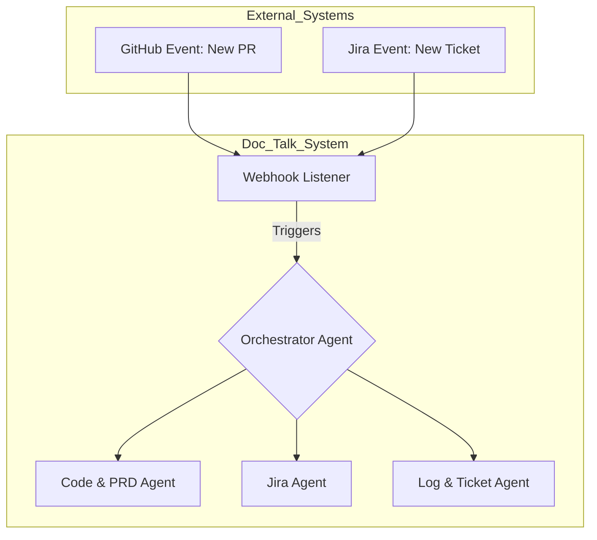

# Phase 4: The Proactive SDLC Assistant

This document outlines the vision for evolving Doc-Talk from a reactive Q&A tool into a proactive, autonomous assistant that actively participates in the software development lifecycle.

## The Vision: From Reactive to Proactive

The core architectural shift in this phase is moving from a request-response model to an **event-driven architecture**. Instead of waiting for a user to ask a question, the agent will be triggered by events from external systems like GitHub and Jira.

### The Architectural Shift: An Event-Driven System

A new **Webhook Listener** service will be the entry point for proactive tasks. This service will listen for events, parse them, and trigger the appropriate agent in our multi-agent system.

## "Out of the Box" Capabilities

This new architecture will enable a set of high-value, proactive capabilities designed to automate monotonous and painful parts of the development cycle.

### 1. The Proactive Code Reviewer
*   **Pain Point:** Manual code reviews are time-consuming and prone to human error.
*   **Capability:** Triggered by a "Pull Request Opened" event from GitHub, the agent will:
    1.  Read the PR's code changes (the diff).
    2.  Cross-reference the changes with its entire knowledge base (architecture docs, PRDs, past tickets).
    3.  Use an LLM to identify potential issues, inconsistencies, or missed test cases.
    4.  Automatically post an insightful, helpful comment on the PR.

### 2. The Automated Documentation Writer
*   **Pain Point:** Technical documentation is almost always out of date.
*   **Capability:** Triggered by a "Pull Request Merged" event, the agent will:
    1.  Analyze the merged code.
    2.  Identify which architecture or API documents are affected.
    3.  Automatically generate a draft of the updated documentation and, potentially, create a new PR with the documentation changes.

### 3. The Onboarding Buddy
*   **Pain Point:** Onboarding new engineers is slow and takes up significant senior developer time.
*   **Capability:** While still a reactive feature, this leverages the comprehensive knowledge base built for the proactive agents. A new team member could ask:
    *   *"I've been assigned a ticket in the `returns-svc`. Where is the best place in the codebase to start looking?"*
    *   *"Give me a learning path to understand the checkout process."*
    The agent would provide a personalized onboarding experience, complete with links to the most relevant code, documents, and key personnel.
