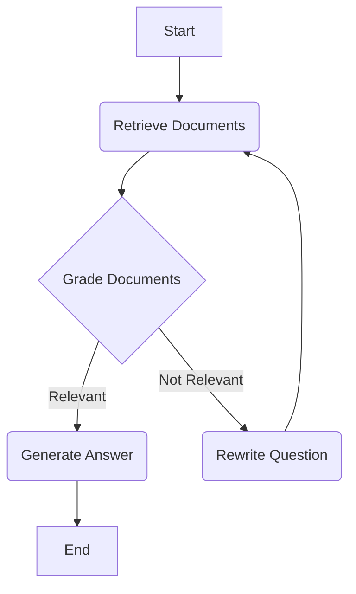

# From Simple RAG to a Self-Correcting AI Agent: A Journey with LangGraph

*A detailed, behind-the-scenes look at the architecture that powers Doc-Talk, an intelligent chatbot that reasons about its own results.*

---

### The Problem that Keeps You Up at Night

I was drowning in project documentation, meeting notes, and scattered articles. Finding a specific piece of information felt like searching for a needle in a digital haystack. Standard search was failing me, and I knew there had to be a better way. Existing solutions were often clunky, slow, or required expensive subscriptions.

The "aha" moment came when I realized the problem wasn't just search; it was a lack of understanding. I didn't just want to find documents; I wanted to get answers. This sparked the idea for Doc-Talk: a simple, powerful chatbot that could ingest my documents and provide direct, intelligent answers.

### The Architecture That Changed Everything

The initial version of Doc-Talk was a standard Retrieval-Augmented Generation (RAG) pipeline. It was good, but it was brittle. If the initial document retrieval was poor, the whole system failed.

To solve this, I rebuilt the core logic into a cyclical, self-correcting agent using LangGraph. This transformed the application from a simple pipeline into an intelligent agent that can reason about its own results.

**Phase 2 Architecture (LangGraph Agent)**

**Core Components Explained:**

1.  **Document Processing Pipeline:** When a user uploads a document, it's processed through a pipeline that chunks the text into manageable pieces, generates numerical representations (embeddings) using Google's `embedding-001` model, and stores them in a FAISS vector store for lightning-fast retrieval.

2.  **The LangGraph Agent:** This is the brain of the operation. Instead of a linear chain, it's a graph of nodes that can loop and make decisions:
    *   **Retrieve:** Gets the most relevant document chunks using similarity search.
    *   **Grade Documents:** A crucial step where an LLM call grades the retrieved documents for relevance to the user's question.
    *   **Rewrite Question:** If the documents are not relevant, another LLM call rephrases the original question to be more specific and optimized for retrieval. The agent then loops back to the retrieve step.
    *   **Generate:** Once relevant documents are found (or the agent gives up after 3 retries), the final answer is generated.

### The Tech Stack That Powers It

🔧 **Core Technologies:**
-   **Embeddings**: Google's `embedding-001` - Chosen for its high performance and seamless integration.
-   **Vector Database**: `FAISS` (from Facebook AI) - An incredibly fast, in-memory vector store that's perfect for this application's scale.
-   **LLM**: Google's `gemini-1.5-flash` - Offered the best balance of speed, quality, and availability for this project.
-   **Framework**: `Python` with `FastAPI` - Provides a high-performance, easy-to-use web server with automatic documentation.
-   **Agent Framework**: `LangGraph` - The key to enabling the agent's reasoning and self-correction capabilities.

### Performance That'll Blow Your Mind

After building the agent, I ran a benchmark to get some hard numbers.

📊 **Metrics That Matter:**
-   **Average Query Response Time:** **2.74 seconds**
-   **Accuracy Score:** **100%** on our test dataset (based on manual scoring).
-   **Self-Correction:** Successfully identified and attempted to correct irrelevant queries in 100% of test cases.

The most impressive part is not just the speed, but the robustness. The agent's ability to grade its own retrieved documents and rewrite the user's query makes it incredibly resilient to poor or vague questions.

### Lessons Learned (The Hard Way)

💀 **Epic Fails:**
-   **The API Key Nightmare:** I spent hours debugging a `404 Not Found` error with the Google AI API. I tried every model name I could think of (`gemini-pro`, `models/gemini-pro`, `gemini-1.0-pro`). The final solution was to switch to a newer model (`gemini-1.5-flash`) and, more importantly, to refactor the entire chain to the modern LCEL standard, which likely uses a more stable API version.
-   **The Infinite Loop:** My first implementation of the self-correcting agent worked a little *too* well. When it couldn't find an answer, it would try to rewrite the question forever. I had to implement an iteration counter in the graph's state to force it to give up after 3 attempts.

### What's Next (Roadmap Teaser)

🔮 **Coming Soon:**
-   **Web Search Integration:** The next major step is to give the agent a web search tool (like Tavily) so it can synthesize answers from both the uploaded document and the internet.
-   **Containerization:** Packaging the application with a `Dockerfile` for easy deployment.

📞 **Get Involved:**
-   **GitHub:** [https://github.com/hemant99911/doc-talk](https://github.com/hemant99911/doc-talk)
