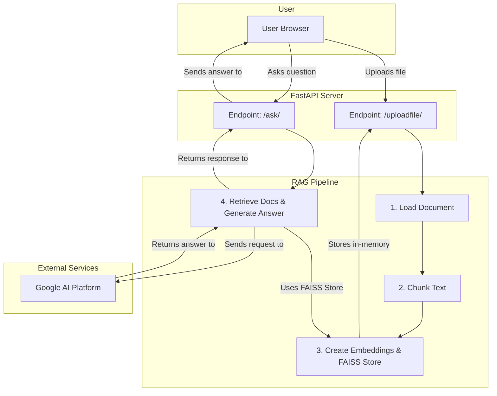

# System Architecture

This document contains the architecture diagrams for the Doc-Talk application.

## Current Architecture

This diagram represents the initial design of the RAG pipeline and the FastAPI server.

