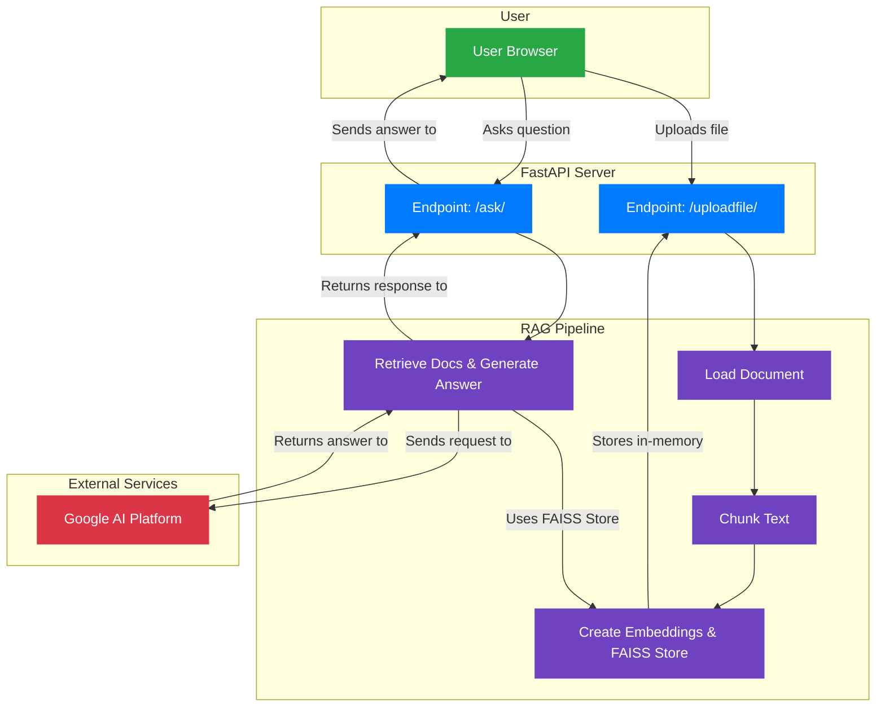
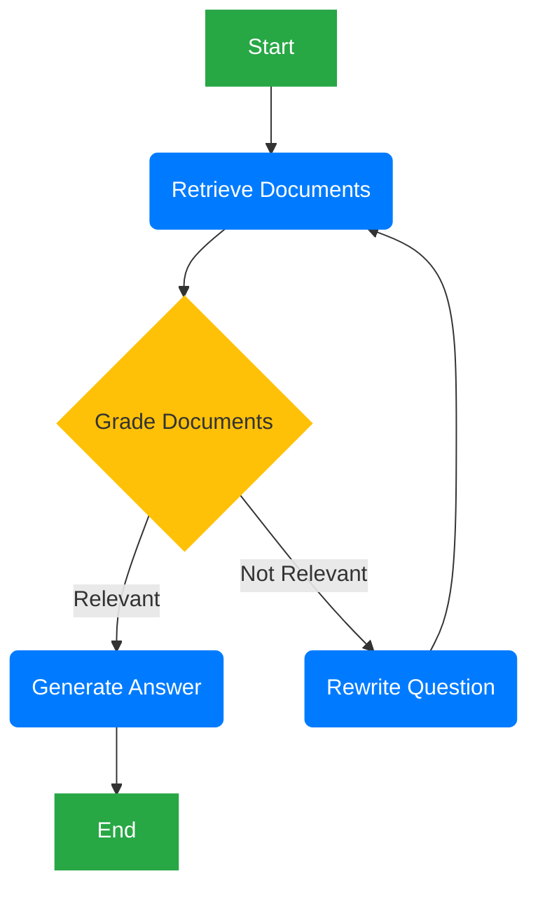

# System Architecture

This document contains the architecture diagrams for the Doc-Talk application.

## Phase 1 Architecture (Simple RAG Chain)

This diagram represents the initial design of the RAG pipeline and the FastAPI server.



## Phase 2 Architecture (LangGraph Agent)

This diagram illustrates the cyclical, self-correcting agent architecture using LangGraph.



## Phase 2.2 Architecture (Synthesis Agent with Web Search)

This diagram shows the final agent design, which can synthesize answers from both local documents and a web search tool.

```mermaid
graph TD
    %% Define styles
    classDef startEnd fill:#28a745,color:#fff,stroke:#28a745,stroke-width:2px;
    classDef process fill:#007bff,color:#fff,stroke:#007bff,stroke-width:2px;
    classDef decision fill:#ffc107,color:#333,stroke:#ffc107,stroke-width:2px;
    classDef web fill:#17a2b8,color:#fff,stroke:#17a2b8,stroke-width:2px;

    A[Start]:::startEnd --> B(Retrieve Document):::process;
    B --> C{Grade Document}:::decision;
    C -- Relevant --> D{Web Search Needed?}:::decision;
    C -- Not Relevant --> E(Rewrite Question):::process;
    E --> B;
    D -- Yes --> G(Web Search):::web;
    D -- No --> F(Generate Answer):::process;
    G -- Web Results --> F;
    F --> H[End]:::startEnd;
