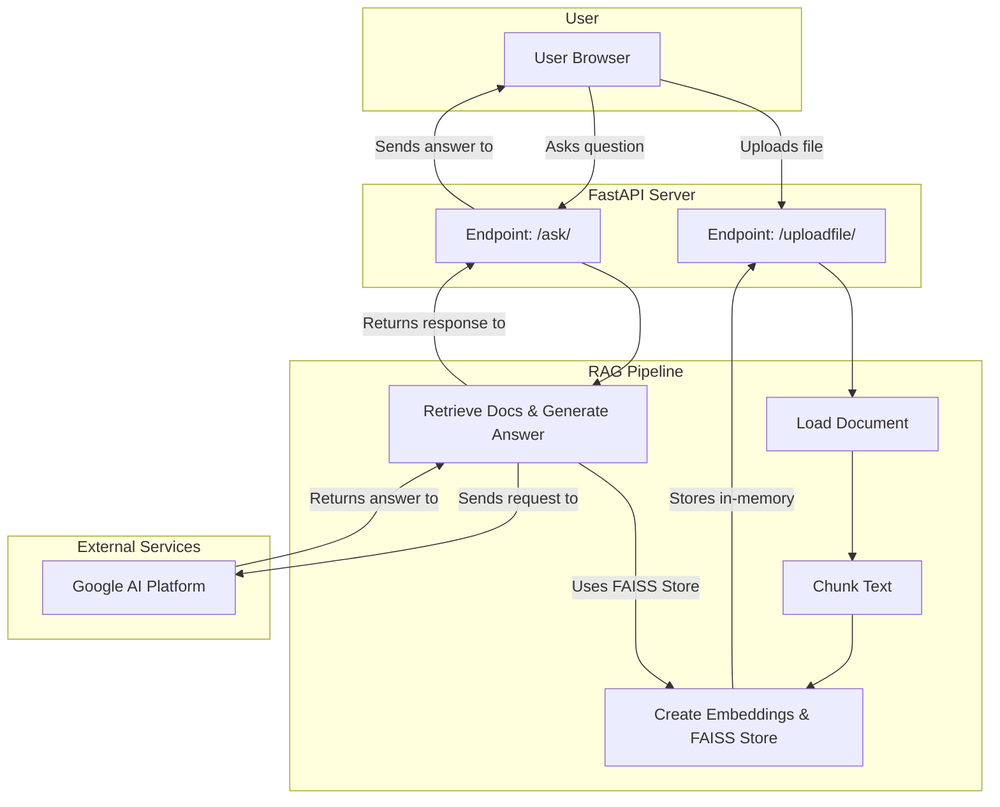

# System Architecture

This document contains the architecture diagrams for the Doc-Talk application.

## Current Architecture (Simple RAG Chain)

This diagram represents the initial design of the RAG pipeline and the FastAPI server.



## Phase 2 Architecture (LangGraph Agent)

This diagram illustrates the cyclical, self-correcting agent architecture using LangGraph.

```mermaid
graph TD
    A[Start] --> B(Retrieve Documents);
    B --> C{Grade Documents};
    C --o Relevant --> D(Generate Answer);
    C --x Not Relevant --> E(Rewrite Question);
    E --> B;
    D --> F[End];
