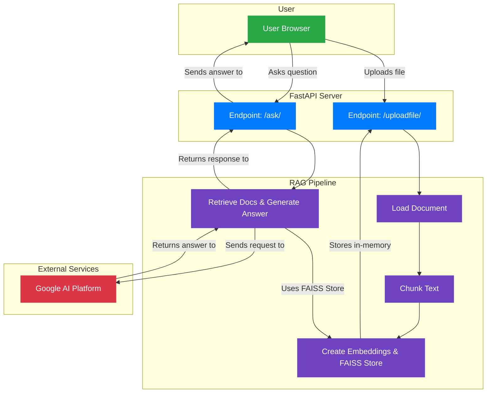
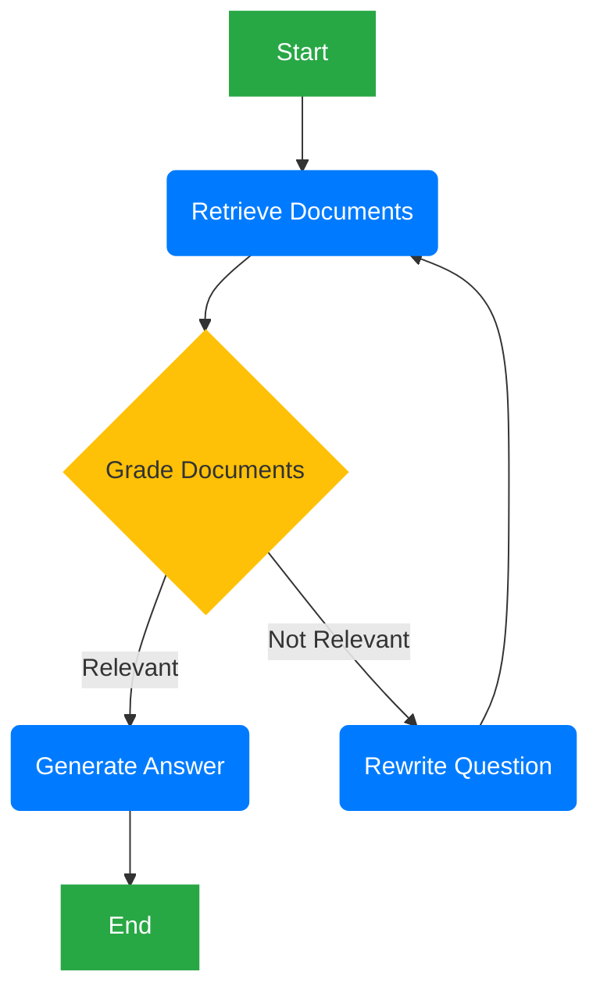
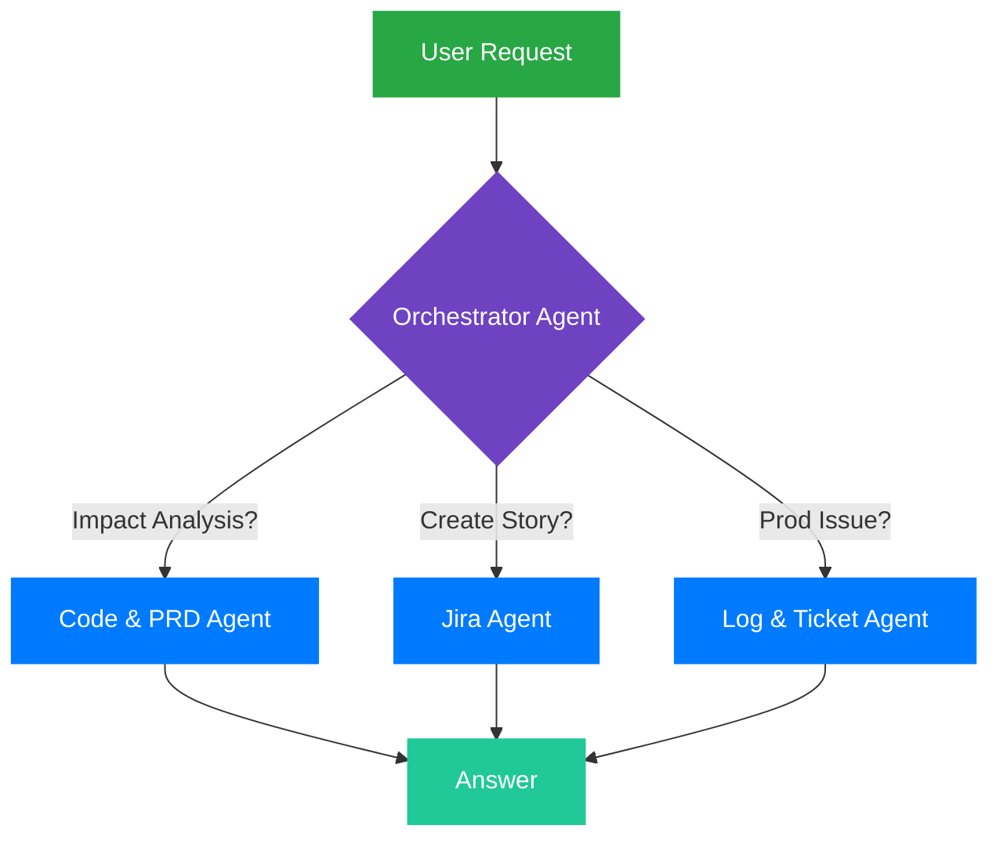

# System Architecture

This document contains the architecture diagrams for the Doc-Talk application.

## Phase 1 Architecture (Simple RAG Chain)

This diagram represents the initial design of the RAG pipeline and the FastAPI server.



## Phase 2 Architecture (LangGraph Agent)

This diagram illustrates the cyclical, self-correcting agent architecture using LangGraph.



## Phase 3 Architecture (Multi-Agent Orchestrator)

This diagram shows the high-level architecture for a multi-agent system, where a central orchestrator delegates tasks to specialized agents.



## Phase 4 Architecture (Proactive, Event-Driven Agent)

This diagram shows the final agent design, which is triggered by external events and can proactively assist the development team.

```mermaid
graph TD
    %% Define styles
    classDef event fill:#dc3545,color:#fff,stroke:#dc3545,stroke-width:2px;
    classDef listener fill:#fd7e14,color:#fff,stroke:#fd7e14,stroke-width:2px;
    classDef orchestrator fill:#6f42c1,color:#fff,stroke:#6f42c1,stroke-width:2px;
    classDef agent fill:#007bff,color:#fff,stroke:#007bff,stroke-width:2px;

    subgraph External_Systems
        A[GitHub Event: New PR]:::event
        B[Jira Event: New Ticket]:::event
    end

    subgraph Doc_Talk_System
        C[Webhook Listener]:::listener
        D{Orchestrator Agent}:::orchestrator
        E[Code & PRD Agent]:::agent
        F[Jira Agent]:::agent
        G[Log & Ticket Agent]:::agent
    end

    A --> C
    B --> C
    C -- Triggers --> D
    D --> E
    D --> F
    D --> G
