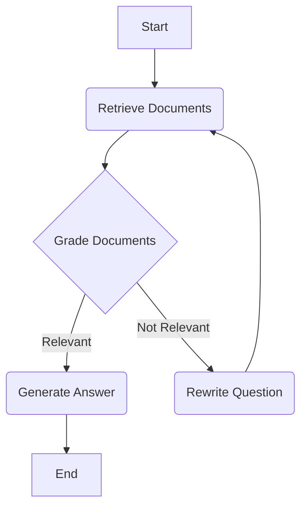

# System Architecture

This document contains the architecture diagrams for the Doc-Talk application.

## Phase 1 Architecture (Simple RAG Chain)

This diagram represents the initial design of the RAG pipeline and the FastAPI server.


## Phase 2 Architecture (LangGraph Agent)

This diagram illustrates the cyclical, self-correcting agent architecture using LangGraph.



## Phase 2.2 Architecture (Synthesis Agent with Web Search)

This diagram shows the final agent design, which can synthesize answers from both local documents and a web search tool.

```mermaid
graph TD
    A[Start] --> B(Retrieve Document);
    B --> C{Grade Document};
    C -- Relevant --> D{Web Search Needed?};
    C -- Not Relevant --> E(Rewrite Question);
    E --> B;
    D -- Yes --> G(Web Search);
    D -- No --> F(Generate Answer);
    G -- Web Results --> F;
    F --> H[End];
